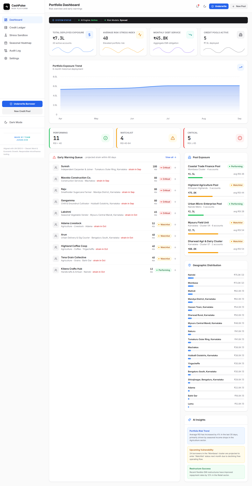

# CashPulse: The Intelligent Microfinance Atlas

<div align="center">
  
</div>

<br />

CashPulse is a high-performance, dynamic risk analysis platform tailored for lenders and microfinance institutions. Built by **Team Jugad.exe** for the Manipal Hackathon, it evaluates borrower affordability by reasoning about cash-flow patterns, repayment stress, and structural loan alternatives.

---

## 🎯 The Problem

Many microfinance borrowers do not receive income or incur expenses on a predictable monthly schedule. A fixed repayment plan can create unnecessary pressure even when a borrower is fundamentally capable of repaying a loan. 

Lenders need to understand not only whether a borrower is likely to repay, but **how repayment interacts with changing cash availability**. Historical income, expenses, transactions, and repayment behavior reveal periods of financial stress, seasonal patterns, and signs that a borrower's financial position is changing.

## 💡 Our Solution

**CashPulse** helps lenders structure and evaluate repayment in a way that balances borrower affordability with sustainable recovery. The system reasons about cash-flow patterns, periods of repayment stress, alternative repayment structures, and changes in financial condition, while explaining the evidence behind its recommendations.

---

## 📸 Screenshots

### 1. The Portfolio Dashboard
An overview of total deployed exposure, AI-generated risk insights, and interactive global heatmaps displaying geographical risk.
<div align="center">
  
</div>

### 2. The Credit Ledger & Dossier
Advanced multi-tier filtering for the entire borrower pool, along with deep-dive dossier charts tracking the Risk Stress Index (RSI) over time.
<div align="center">
  
</div>

---

## ✨ Core Features

- **Dynamic Risk Heatmap**: Calendar visualizing projected income fluctuations indicating potential repayment stress.
- **Floating GeoWidget**: An interactive, animated map card showing regional borrower distribution.
- **Global Search (`Cmd+K`)**: Lightning-fast borrower discovery.
- **AI Insights Summary**: Dynamic risk evaluation on the dashboard highlighting trends and vulnerabilities.
- **Collateral Tracker**: Full tracking within the Underwrite Wizard.
- **Custom Alert Thresholds**: Live settings manipulation for thresholds like Critical RSI.
- **Dossier Area/Line Charts**: Deep financial health visualizations tracking RSI.
- **Ledger Enhancements**: Advanced multi-filters, bulk export, and quick-add payments.

---

## 🚀 Tech Stack

- **Framework**: React + Vite + TypeScript
- **Styling**: Tailwind CSS
- **Animations**: Framer Motion
- **Charts**: Recharts
- **Icons**: Lucide React
- **Deployment**: Vercel

---

## 🛠️ Getting Started

To run CashPulse locally:

1. Clone the repository:
   ```bash
   git clone https://github.com/IntellectDaksh/Jugad.exe---Manipal-Hackathon-Atlas-.git
   cd Jugad.exe---Manipal-Hackathon-Atlas-
   ```
2. Install dependencies:
   ```bash
   npm install
   ```
3. Run the development server:
   ```bash
   npm run dev
   ```

---
*Made with ❤️ by Team Jugad.exe*
